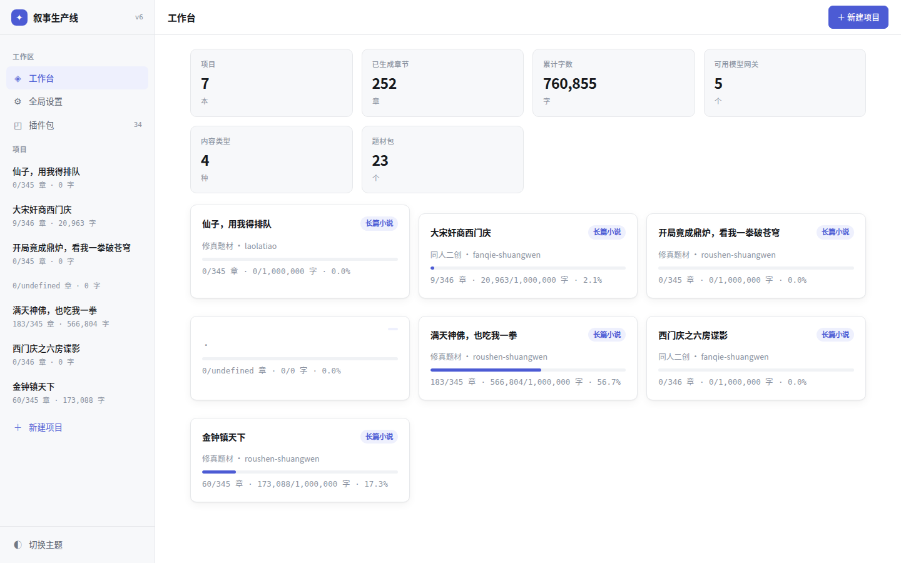
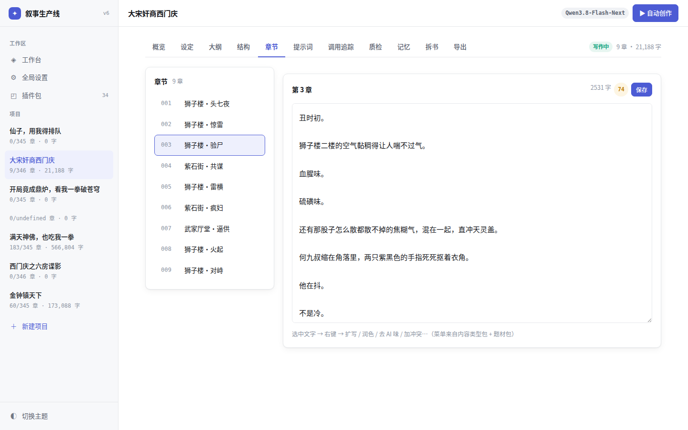
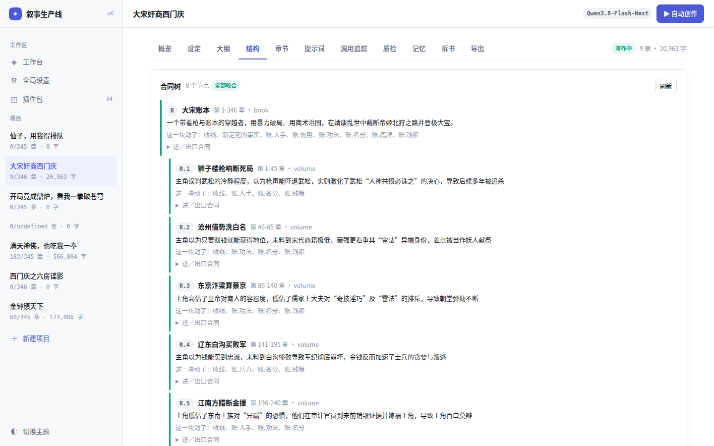
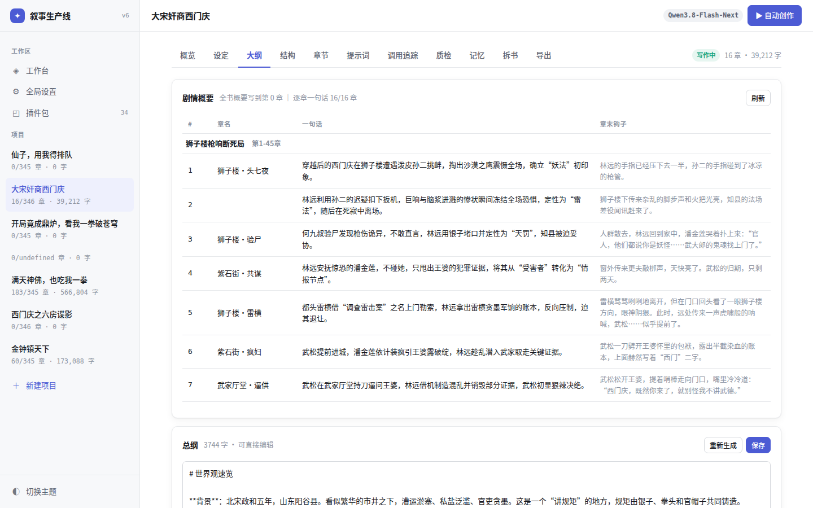
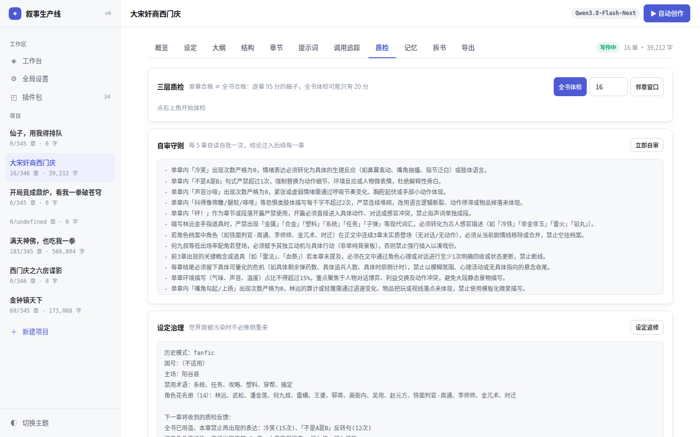
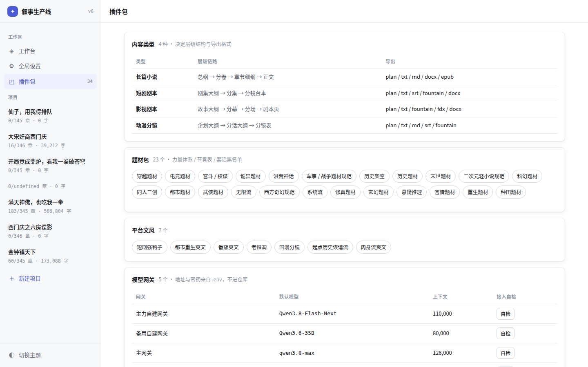
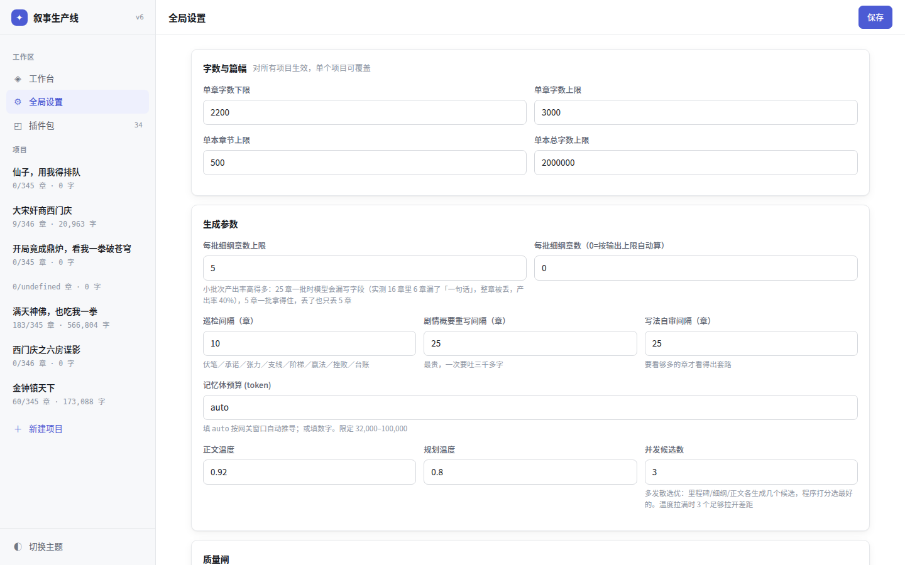

# AI 长文本创作流水线（小说 / 短剧 / 影视 / 动漫分镜）

## 这是什么

一条把「一句话设定」写成成品长文本的自动流水线。**不只写小说** —— 四种内容类型共用同一套引擎（合同树、多候选选优、程序评审、自动返修），只是层级和成品不同：

| 类型 | 层级流水线 | 成品 | 导出 |
|---|---|---|---|
| 长篇小说 | 总纲 → 分卷 → 逐章细纲 → 正文 | 章节正文 | txt / epub |
| 短剧剧本 | 系列企划 → 分集 → 分镜台本 | 逐镜台本（钩子节奏） | 台本 |
| 影视剧本 | 故事大纲 → 分幕分场 → 剧本页 | 标准剧本页 | Fountain / FDX |
| 动漫分镜 | 企划大纲 → 分话 → 分镜表 | 镜号/景别/画面/台词/时长 | 分镜表 / 字幕 |

类型定义在 `packs/type/*.json`（层级、字段、提示词模板、默认文风、导出器全部包内声明，加新类型不改引擎代码）。四类型均有守门测试（`tests/unit/test_content_types.py`）。

以长篇小说为例的完整链路：

```
种子（一句话设定）
  → 根合同（全书进口/出口：账目、线头、事实，结构化字段，不是散文）
  → 里程碑链（全书拆成 30 节推进链，程序校验相邻节咬合）
  → 逐章细纲（每章发散 3 个候选，程序按判据选优）
  → 正文（每章 3 个候选，硬闸淘汰 + 文风闸比较）
  → 评审（模型只报带正文原句证据的问题，分数由程序按扣分表算）
  → 自动返修 → 回炉发散 → 仍不行才标 MANUAL 等人
```

两条使用路径：

- **Web UI**：建书、看合同树、逐章读正文、改设定、调参数
- **守护进程**：`scripts/guard.sh` 起一个哨兵，长跑崩了自动拉起，写满目标章数为止

### 界面

| 工作台 | 新建项目（四种内容类型） |
|---|---|
|  |  |

| 章节正文 | 结构（合同树） |
|---|---|
|  |  |

| 大纲与分章细纲 | 记忆（五层预算） |
|---|---|
|  |  |

| 质检 | 包管理 |
|---|---|
|  |  |

| 导出 | 全局设置 |
|---|---|
|  |  |

## 快速开始

```bash
pip install -r requirements.txt
cp .env.example .env && vim .env     # 填至少一个网关（见下节）

# 起 Web 服务（端口用 NOVEL_PORT 指定，默认 60001）
python3 -m server.app
# 或者用脚本（后台跑，日志在 reports/server.log）
bash scripts/serve.sh start          # → http://127.0.0.1:60001/

# 全自动长跑：哨兵每 180 秒检查一次，每轮写 20 章，崩了自动拉起
bash scripts/guard.sh "书名" 180 20

# 停长跑
bash scripts/stop_run.sh
```

服务绑 `0.0.0.0`。公网可达时务必在 `.env` 设置 `NOVEL_PASSWORD`，否则任何人都能进来调你的模型。

## 大模型接入

模型配置全部在 `config/providers.yaml`，真实地址与密钥全部走 `.env`（已 gitignore，仓库里不含任何凭据）。

### gateways：网关定义

每个网关是一个 OpenAI 兼容端点（`/v1/chat/completions`），`base_url` 和 `api_key` 从 `.env` 读：

```yaml
gateways:
  gw1:
    type: openai_compat
    label: "自建 OpenAI 兼容网关"
    base_url: ${NOVEL_GW1_URL}          # 如 https://your-gateway.example.com/v1
    api_key: ${NOVEL_GW1_KEY:-EMPTY}    # vLLM 裸跑填 EMPTY 即可
    default_model: ${NOVEL_GW1_MODEL}
    reasoning_field: reasoning          # 思考内容走哪个字段（vLLM 用 reasoning，
                                        # DeepSeek/Qwen 系用 reasoning_content）
    context_window: 110000
    max_tokens: 8192
```

除此之外网关还能声明**思考开关的形态**——这是各家真正不兼容的地方：

- `thinking_style: toggle`——能彻底关（vLLM / Qwen 系发 `enable_thinking=false`）
- `thinking_style: effort`——关不掉只能调档（GLM 系传 `enable_thinking=false` 直接 400）
- `thinking_style_by_model`——聚合网关上同时挂多个模型族时按模型名前缀覆盖。
  实测同一条 6.2 万字提示词，qwen 系配错成 effort 要 109s 且烧 4096 思考 token，
  换 toggle 后 36s、思考 0

### profiles：任务分档

流水线按任务把调用分成四档，各自指定网关、思考开关与温度：

```yaml
profiles:
  planning:   {gateway: gw1, thinking: false, temperature: 1.0}    # 拆合同/排细纲
  drafting:   {gateway: gw1, thinking: false, temperature: 1.0}    # 写正文
  polishing:  {gateway: gw1, thinking: false, temperature: 0.95}   # 润色/摘要/小任务
  judging:    {gateway: gw1, thinking: false, temperature: 0.30}   # 评审——它是尺子，
                                                                   # 温度必须低
default_profile: drafting
```

创作档温度拉高是有意的：多候选选优要靠温度拉开三稿的差距；judging 温度低是因为尺子自己飘了章与章的分数就不可比。

### 加一个新网关 / 新模型

零代码，两步：

1. `config/providers.yaml` 加一段：

```yaml
  gw7:
    type: openai_compat
    label: "我的新网关"
    base_url: ${NOVEL_GW7_URL}
    api_key: ${NOVEL_GW7_KEY:-EMPTY}
    default_model: ${NOVEL_GW7_MODEL}
    reasoning_field: reasoning_content
    context_window: 128000
    max_tokens: 8192
```

2. `.env` 加对应变量：

```ini
NOVEL_GW7_URL=https://your-gateway.example.com/v1
NOVEL_GW7_KEY=sk-xxxx
NOVEL_GW7_MODEL=your-model-name
```

然后把想用它的 profile 的 `gateway:` 改成 `gw7`。自建 vLLM 实例就是这么接的（`api_key` 填 `EMPTY`）。

### UI 设置页会覆盖什么

「全局设置」页保存时写 `config/settings.local.yaml`（只存与基线不同的项），优先级：**项目覆盖 > settings.local.yaml > settings.yaml > 代码默认**。其中：

- **正文温度 / 规划温度**：覆盖 providers.yaml 里 drafting / planning 两档的温度
- **并发候选数**（默认 3）：里程碑 / 细纲 / 正文三处的多发散选优都用它；设 1 退化为单稿直出
- **单章字数上下限、每批细纲章数、巡检/概要/自审间隔、记忆体预算**：覆盖 `config/settings.yaml` 同名项

## 便宜模型怎么选

先算清调用量级（数字来自 `projects/<书名>/trace/` 的实测记录）：

- **顺利的一章约 11~15 次调用**：正文 3 候选 + 评审 2~4 遍 + 细纲/规划 2 次 + 台账抽取、标题、摘要等小调用约 6 次
- **整书均值更高**——返修、回炉、巡检都要调用：实测一本 183 章的书累计 5013 次（约 27 次/章），一本 60 章的书 2197 次（约 37 次/章），一本返修密集的书 9 章烧了 731 次（约 80 次/章）
- 单次调用不小：drafting 提示词约 2 万字，评审约 3.5 万字

所以模型按分工选，别全上贵的：

- **drafting / polishing**（调用最多、输出最长）：小而快的低价档就够——qwen-flash 系、glm-4-flash、deepseek-chat 这一类。本仓库两本 50 万字级的书就是 qwen flash 档写完的
- **judging**：要的不是文采，是**稳定跟随指令输出 JSON**——评审结果解析失败或缺字段，那一遍就静默丢了。选 JSON 输出稳的模型，温度压到 0.3
- **planning**：拆合同、排里程碑最吃推理，预算有富余可以单独给这一档换强一点的模型（profiles 按档指定网关，正好干这个）

自建 vLLM 或任何 OpenAI 兼容网关都支持，见上节。

## 整体优势

不列形容词，列机制和实测数：

- **合同树程序校验**：每个节点带结构化进口/出口（账目/线头/事实三类字段），「上一块出口 == 下一块进口」由程序逐字段比对，不靠模型自觉。UI 结构页直接显示「全部咬合」或哪一处断了
- **多候选程序选优**：细纲三候选的裁判纯程序（收回章数、到期伏笔是否安排回收、钩子查重、账目推进配比），不额外花评审调用；正文三候选先过硬闸（接缝重复/元语言泄漏/黑名单穿帮词等任一命中出局）再比文风指标
- **评审只认证据，分数程序算**：模型只报「问题 + 正文原句引证」，没有原句的问题程序直接剔掉；分数由程序按扣分表从可数的证据推出来，谁都能复核
- **硬账台账**：兵力、钱粮这类可计数状态由程序记账、程序对数——正文里出现的数字与台账不符当场报，防「上一章 119 发子弹、下一章 12 发」这类跳变
- **熔断 + 三级自愈**：连续 5 章被判「需人工」或滑窗 10 章里 6 章坏，写 `HALT.md` 停跑（连片坏章是同一个根子在批量产废品，继续烧没有意义）；守护先自动返修，返修不动就回炉发散（回滚坏段、细纲重新三候选），同段回炉两轮仍坏才标 MANUAL 等人
- **357 条单元测试** + 浏览器 E2E：`python3 -m pytest tests/unit -q`

## 已知限制

- **小模型的接续滑差压不到零**。第 N+1 章开头接不准第 N 章结尾的情况仍会发生，靠评审抓 + 返修兜底，不是生成时就杜绝
- **被评审拦下的章在修好之前仍留在书里**。流水线是「记账 + 进返修队列 + 继续写」，不会把坏章自动下架；连片坏到阈值才熔断停跑
- **外网搜索默认关闭**（见下节），考据依赖模型自身知识，真实历史题材的具体数字、职官细节有编造风险
- Web 服务用的是 Flask 自带的开发服务器，单机自用设计

## 搜索与资料库

**现状**：`config/settings.yaml` 里 `memory.web_search: false`——外网搜索默认关。另外架空世界（`history_mode=invented`）无论开关如何都不联网：架空里的「考据」没有权威来源，一炷香多久是本书自己定的规矩。

**替代方案（默认启用）**：`server/retrieval.py` 的 `fact_from_model`——查什么仍由模型规划（读设定/细纲后列出「这一章要查证什么」），但检索源换成大模型自身知识，产出结构化考据卡（具体到数目、时辰、称呼、手续，并附「写错了会穿帮的地方」），落盘复用：

- 本书的卡：`projects/<书名>/facts.json`
- 跨书共享缓存：`.cache/facts.json`（同一时代同一件事别的书查过就直接用）
- 联网检索的原始结果缓存（开外搜时）：`projects/<书名>/research/`

**支持的检索引擎**（`server/providers/search.py`，`config/providers.yaml` 的 `search:` 段声明，`default:` 指定用哪个）：

| type | 说明 | 启用要什么 |
|---|---|---|
| `bocha` | 博查 AI 搜索（中文效果最好，按次计费；结果跨书缓存在 `.cache/search`，命中不计费，真实请求计数在 `search_usage.json`） | `.env` 填 `NOVEL_BOCHA_KEY` |
| `searxng` | 自建/公共 SearXNG 实例（免费；实测公共实例质量参差——名义 85 家引擎实际只有 2 家在服务，bing 一半是短视频电商，只建议做兜底） | `.env` 填 `NOVEL_SEARCH_URL` 指向实例，配置里可用 `engines:` 列表指定引擎优先级 |
| `http_json` | 任意返回 JSON 的开放搜索接口（OpenSearch 兼容），自定义字段映射 | 配置里给 `endpoint` 与字段映射 |
| `null` | 空实现——没配任何检索源时的占位，上层代码不必判空 | 无 |

**打开步骤**：① `config/settings.yaml` 把 `memory.web_search` 改 `true`；② `.env` 填对应密钥/地址；③（可选）`providers.yaml` 的 `search.default` 换默认源。单章外查条数由 `memory.web_max_per_chapter` 限制（默认 4），查过的全书复用。

## 部署

```bash
cp .env.example .env && vim .env
docker compose up -d          # → http://localhost:60001/（附带 SearXNG 检索容器）
docker compose up -d app      # 只起主服务，检索自动降级
```

镜像基于 `python:3.12-slim`，实测构建产物 **270MB**。稿件持久化在宿主机 `./projects`，配置与插件包目录挂载进容器可热改。

## 测试

```bash
python3 -m pytest tests/unit -q      # 单元测试 357 条
bash scripts/serve.sh start
python3 tests/e2e/run.py             # E2E，真实浏览器
```

## License

见 [LICENSE](LICENSE)。
