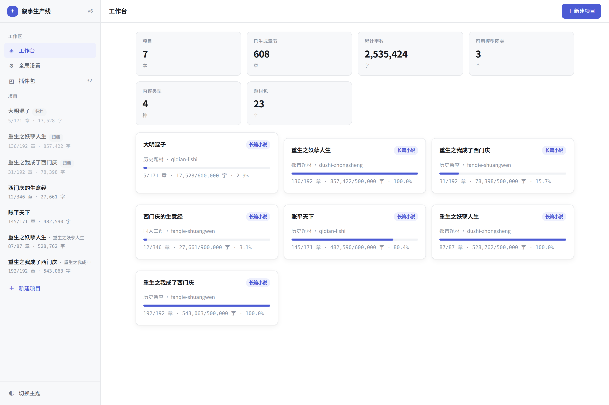
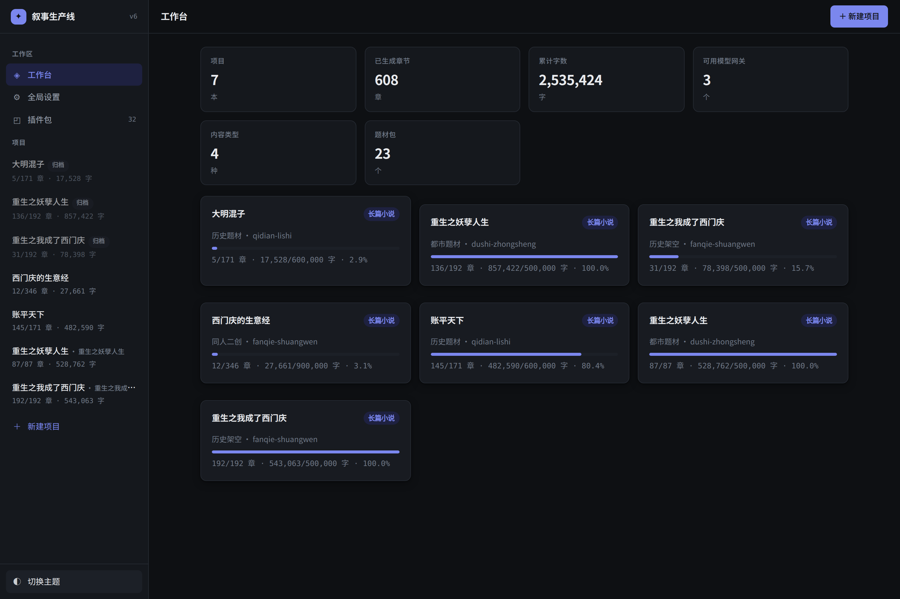
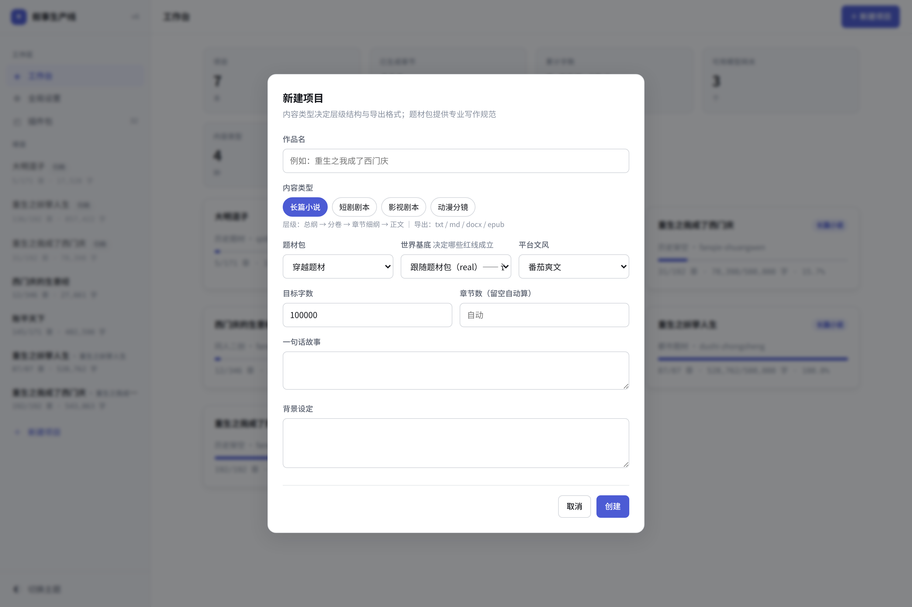
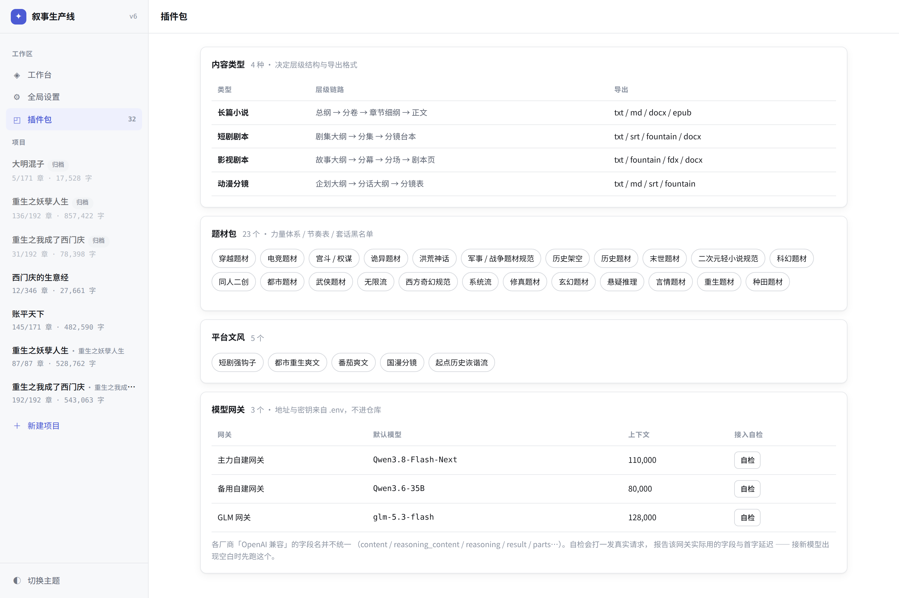
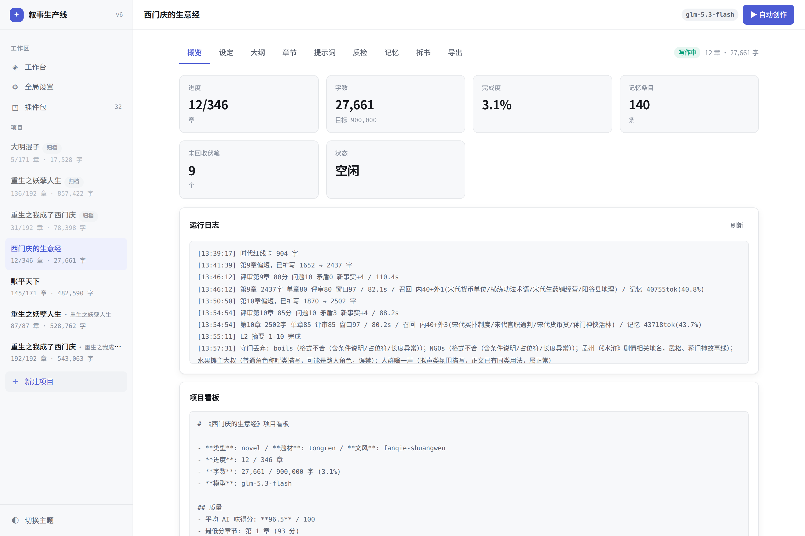
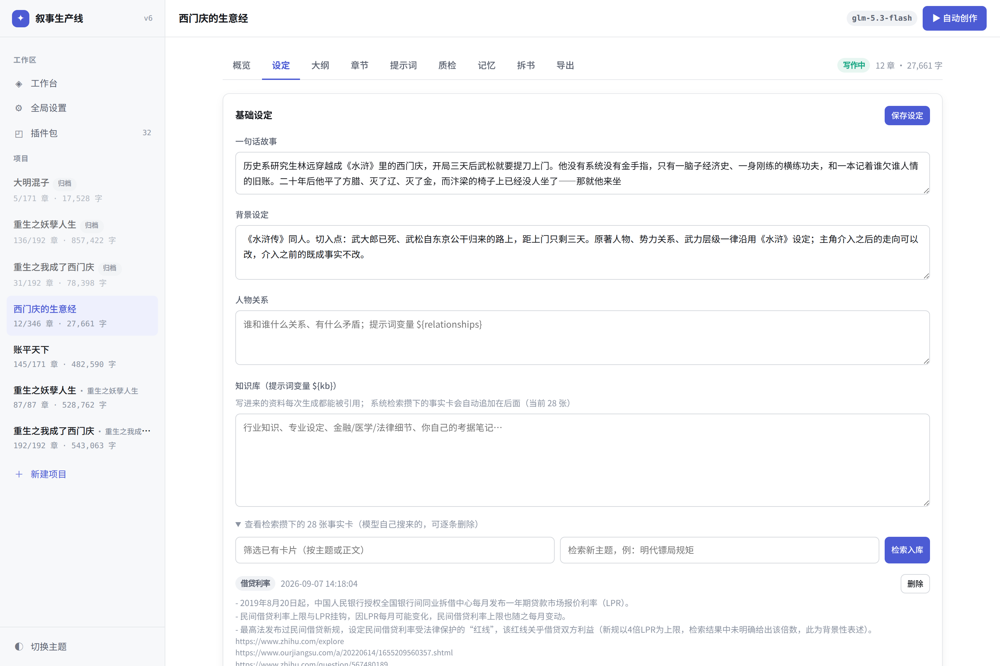
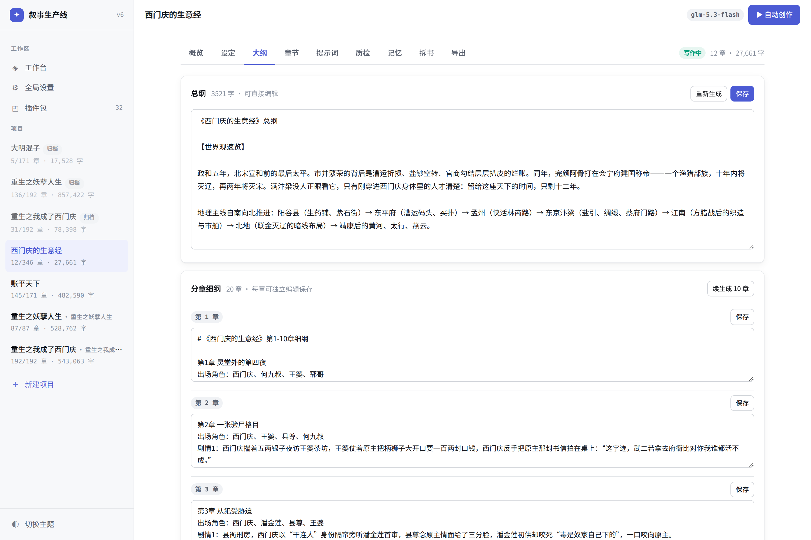
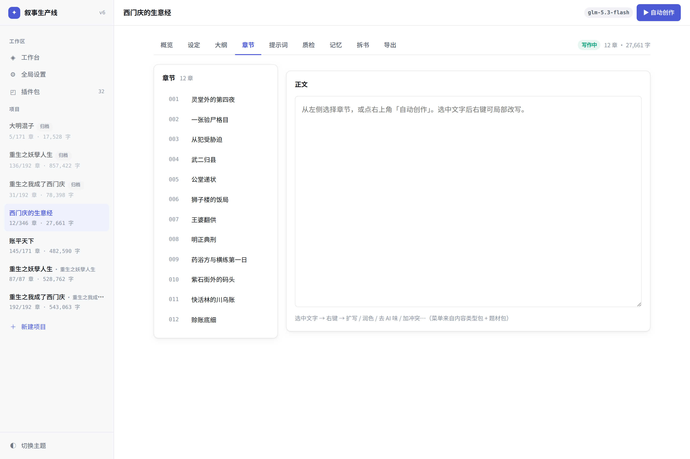
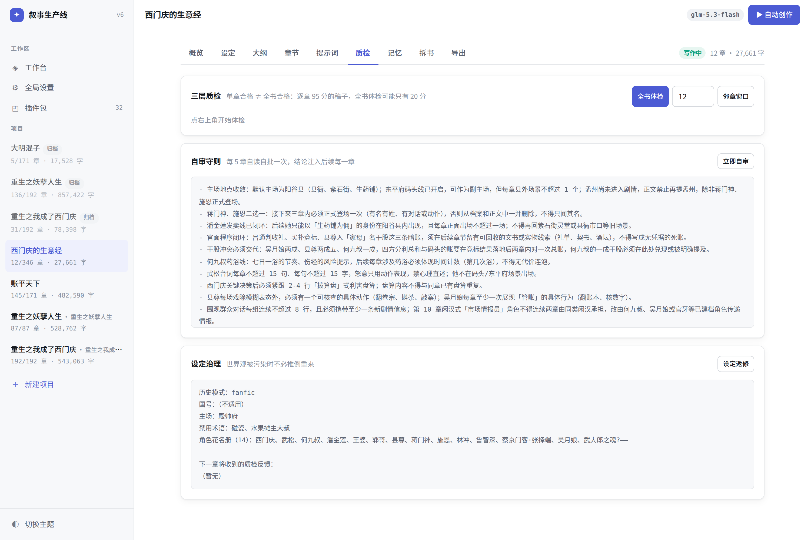
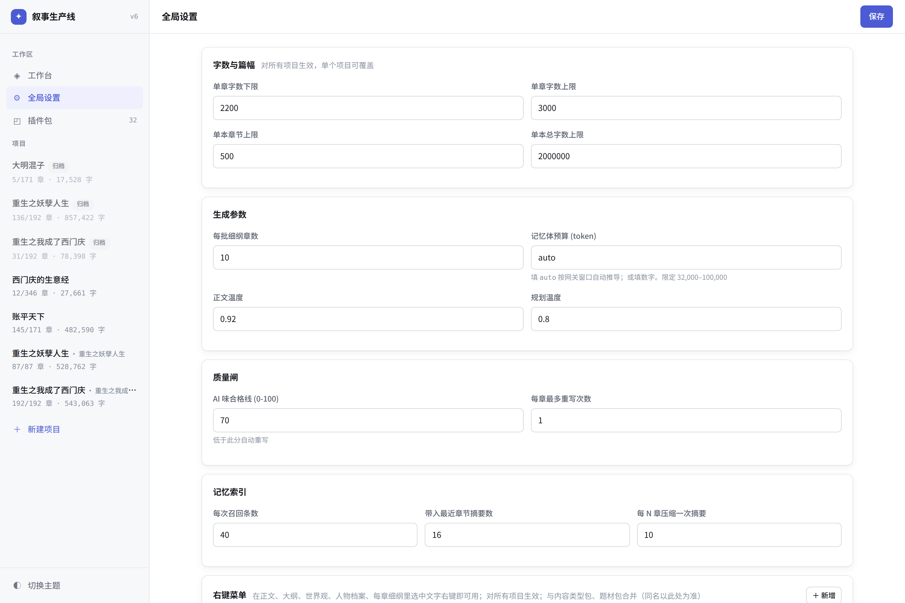

# AI 叙事内容生产线

**一句话设定，写完一本 50 万字的长篇。** 从 v5.2「AI 小说创作助手」重构而来，
数百家工作室与个人作者用过它的前身；这一版把单页 jQuery 应用重做成可插拔的
长文本创作引擎 —— 内容类型、题材知识、模型供应商、导出格式全部是插件。

一次设定，多态输出：**长篇小说 / 影视剧本 / 短剧台本 / 动漫分镜**。

```
一句话设定 → 世界基底 → 世界观 → 角色档案 → 总纲 → 分卷 → 细纲 → 逐章正文
                                                        ↓
                      单章自审 → 邻章窗口 → 全书体检 → 不合格自动重写/扩写
                                                        ↓
                            八类台账回流下一章的红线约束（伏笔/身份/势力/钱粮…）
                                                        ↓
                    txt / md / epub / 大纲 / Fountain 剧本 / SRT 字幕
```

## 实测

<!-- STATS:BEGIN -->
| | |
|---|---|
| 已写长篇 | **4 本**（2 本完本），累计 **159 万字** / 438 章 |
| 单本最长 | **54.3 万字** |
| 插件包 | 4 种内容类型 / 23 个题材包 / 5 个文风包 |
| 测试 | 单元 82 条 + E2E 27 条 |
<!-- STATS:END -->

> 数字由 `python3 scripts/update_readme.py` 从实际项目统计生成，不手写。

同一把尺子复测，重构前后：

| 指标 | 重构前 | 现在 |
|---|---|---|
| 全书体检 | 20 / 100 | **96 / 100** |
| 架空世界出现真实历史人物 | 47 次 | **0** |
| 朝代名穿帮（宋律/大宋…） | 56 次 | **0** |
| 口癖密度（每万字） | 20.8 | **6.9** |
| AI 味 | ~70% | **~15%** |
| 提示词用量 | 14k tok | **43k–81k tok** |

## 它解决什么

写长篇的难点不是「让模型写一段」，是**写到第 200 章还记得第 3 章埋的东西**。

- 人物不瞬移、伤口不自愈、**职位不退回、门派不会悄悄换掌门**
- 埋了 30 章的伏笔会告急，不会永远悬着
- 钱、修为、官职跨章连续 —— 不会上一章剩三十贯，下一章摆宴百桌
- 洪武朝不冒出玉米，2005 年不冒出微信，水浒同人不把武松写崩
- 全书用滥的表达自动统计，下一章禁用

靠的不是提示词里喊一句「注意前后一致」，是**台账 + 检索 + 红线约束**。

---

## 界面

<table>
<tr>
<td width="50%"><br><sub><b>工作台</b> — 多本书的进度、字数、可用网关与插件包一览</sub></td>
<td width="50%"><br><sub><b>暗色主题</b> — 跟随系统或手动切换，两套完整配色</sub></td>
</tr>
<tr>
<td><br><sub><b>新建项目</b> — 内容类型决定层级链与导出格式；世界基底决定哪些红线成立；文风随类型自动配好</sub></td>
<td><br><sub><b>插件包</b> — 4 种内容类型 / 23 个题材包 / 5 个文风包，点开可看黑名单、常见坑与台账口径</sub></td>
</tr>
<tr>
<td><br><sub><b>项目概览</b> — 进度、AI 味均分、未回收伏笔、实时运行日志；右上角心跳徽标显示「写作中 N 章」</sub></td>
<td><br><sub><b>设定与知识库</b> — 基础设定、世界基底卡、知识库；检索攒下的事实卡可查看来源、可逐条删除、可主动点名检索</sub></td>
</tr>
<tr>
<td><br><sub><b>大纲</b> — 总纲、分卷、每章细纲全部可编辑；保存联动重建索引</sub></td>
<td><br><sub><b>章节</b> — 正文可编辑，右上角实时显示字数与 AI 味评分</sub></td>
</tr>
<tr>
<td><br><sub><b>动态台账</b> — 八类台账（不可逆事实 / 伏笔 / 身份变更 / 势力架构 / 角色状态 / 实力地位 / 资源账 / 时间线）逐条可看可删；下方是 FTS5 检索与五层预算占用</sub></td>
<td><br><sub><b>本书提示词</b> — 内置模板全文可展开、可一键载入编辑；19 个变量由服务端按项目填充</sub></td>
</tr>
<tr>
<td><br><sub><b>三层质检</b> — 单章 / 邻章窗口 / 全书；自审守则与设定治理</sub></td>
<td><br><sub><b>右键改写</b> — 正文、大纲、世界观、人物档案、每章细纲都可选中改写；菜单顶部回显「已选 N 字」</sub></td>
</tr>
<tr>
<td><br><sub><b>全局设置</b> — 字数区间、质量闸、记忆配比、正文写法要求与去 AI 味纪律</sub></td>
<td><br><sub><b>导出</b> — 一份设定导出小说 / 大纲 / Fountain 剧本 / SRT 字幕</sub></td>
</tr>
</table>

<p align="center"><br><sub>窄屏 420px 不破版</sub></p>

---

## 五分钟跑起来

```bash
git clone <repo> && cd AI-automatically-generates-novels
pip install -r requirements.txt
python3 -m playwright install chromium      # 只跑服务可跳过

cp .env.example .env && vim .env            # 填模型地址与密钥
bash scripts/setup.sh                       # docker compose 起全套（含自带 SearXNG）
```

不想用 docker：

```bash
pip install -r requirements.txt
bash scripts/serve.sh start                 # → http://127.0.0.1:60001/
```

`.env` 最少填一个网关：

```ini
NOVEL_GW1_URL=http://your-vllm-host:8000/v1
NOVEL_GW1_KEY=EMPTY
NOVEL_GW1_MODEL=Qwen3.8-Flash-Next
```

> **只有 `/` 一个页面路由**。
> **`.env` 在 `.gitignore` 里，仓库中不含任何真实地址或密钥。**

命令行自动写作（可断点续跑）：

```bash
python3 run_novel.py init --title "我的第一本书" \
    --genre lishi-jiakong --style fanqie-shuangwen --words 500000 \
    --premise "一句话说清主角是谁、开局遇到什么麻烦"

python3 run_novel.py run    --title "我的第一本书" --chapters 20
python3 run_novel.py status --title "我的第一本书"
```

关掉终端、重启服务、换模型都能从 `state.json` 接着写。

---

## 架构：四层可插拔

```
┌──────────────────────────────────────────────────────────┐
│  UI (web/)  面板 / 层级 / 右键菜单 全部由配置渲染，无硬编码  │
└────────────────────────┬─────────────────────────────────┘
┌────────────────────────▼─────────────────────────────────┐
│  编排层 (server/orchestrator.py)                          │
│  世界观→角色→总纲→细纲→正文→自审→重写  断点续写 / 分层记忆   │
└──┬──────────┬───────────┬────────────┬───────────────────┘
┌──▼─────┐ ┌──▼────────┐ ┌▼──────────┐ ┌▼─────────┐
│Provider│ │ContentType│ │ GenrePack │ │ Exporter │
│ 模型   │ │  体裁     │ │  题材     │ │  导出    │
├────────┤ ├───────────┤ ├───────────┤ ├──────────┤
│OpenAI  │ │长篇小说   │ │修真 玄幻  │ │txt md    │
│兼容    │ │影视剧本   │ │武侠 都市  │ │大纲      │
│(vLLM / │ │短剧台本   │ │历史架空   │ │fountain  │
│ 各网关)│ │动漫分镜   │ │… 21 个    │ │srt       │
└────────┘ └───────────┘ └───────────┘ └──────────┘
       放一个文件即扩展，拔掉即卸载
```

### 目录

```
server/       providers/  registry  orchestrator  memory  memory_ctl
              prompt_engine  evaluator  exporters  settings  app
packs/        type/  genre/  style/  common/  shortcuts/
web/          index.html  css/  js/(api ui views app)
config/       providers.yaml  settings.yaml
tests/e2e/    run.py            projects/  运行时项目目录
```

---

## 核心机制

### 1. 模型适配：吃掉「OpenAI 兼容」的不兼容

同一套 API，各家思考字段名都不一样（实测）：

| 模型 | 思考字段 | 备注 |
|---|---|---|
| `Qwen3.8-Flash-Next`（自建 vLLM） | `reasoning` | 非标准 |
| `qwen3.8-max / flash`（聚合网关） | `reasoning_content` | DeepSeek 系约定 |
| Anthropic / Gemini 兼容层 | `thinking` / `thought` | 且 `content` 是 **块数组** |
| 文心一言兼容层 | — | 正文字段叫 `result` |
| Ollama 兼容层 | — | 内容嵌在 `message` 里 |
| 多数模型 | — | 只有 `content` |

正文字段的形状同样兼容 11 种（字符串 / 块数组 / `message` 嵌套 …）。
老版只读 `delta.content`，接 Qwen3.8 **输出一片空白**。现在三种命名全兼容，
`content` 为空时先从 `<answer>` 抢救，再不行自动关思考重试。

**思考开关分两类**：`toggle` 可关（vLLM/Qwen 系），`effort` 关不掉只能调档
（GLM 系，传 `enable_thinking=false` 直接 400）。网关用 `thinking_style` 声明。

> **创作任务默认关思考**。实测开思考写 338 字正文烧掉 2186 字思考（86.6% 浪费），
> 首字慢 6.6 倍，质量无差别。只在规划 / 体检 / 打分时开。

**接新模型先跑自检**：

```bash
curl -s localhost:60001/api/probe -H 'Content-Type: application/json' \
     -d '{"gateway":"gw1"}'
# → fields_seen: ["content"]  first_token_s: 0.83  diagnosis: 正常：内容走 content
```

报告该网关**实际用的字段名**、首字延迟、是否需要 `<answer>` 抢救 ——
接入出现空白时一眼定位是字段名对不上还是模型不返回。

分层调度在 `config/providers.yaml`：

```yaml
profiles:
  planning:  {gateway: gw1, thinking: false, temperature: 0.80}   # 世界观 / 总纲
  drafting:  {gateway: gw1, thinking: false, temperature: 0.92}   # 正文，占 90% 调用
  polishing: {gateway: gw1, thinking: false, temperature: 0.85}   # 润色 / 重写
  judging:   {gateway: gw1, thinking: true,  temperature: 0.30}   # 体检 / 打分
```

### 2. 自我改进循环：写几章就自己读一遍

```
写 N 章 → 全书体检 + 邻章窗口体检 → 抽样正文交 critic 读
        → 产出《本书写作守则》 → 注入后续每一章的约束 → 继续写
```

光把分数打出来没用，必须把「哪里不好、下次怎么写」变成**可执行的守则文本**。
守则每 5 章更新一次（`quality.reflect_every`），分数轨迹记在 `reflect_log.json`。

**质检是三层的**，缺一层都会漏：

| 层 | 抓什么 | 单靠它为什么不够 |
|---|---|---|
| 单章 | 套话密度、结构残留、字数、对话占比 | 「嘴角勾起」一章 1 次不超标 |
| **邻章窗口** | 与前 3 章重复度、开场雷同、剧情原地踏步、角色断线 | 全书统计看不出「这三章在同一场冲突里绕」 |
| **全书** | 口癖泛滥、禁用术语、主角戏份垄断、配角纸片化、主场漂移 | 逐章 95.2 分的稿子，全书体检只有 29 分 |

三层结论**全部回流到下一章的约束**，而不是写完才发现。

### 3. 长程一致性：伏笔 / 角色状态 / 势力架构 / 时间线

每章写完做一次结构化抽取（与摘要合并成一次调用，不额外花钱）：

- **伏笔**：新埋的自动登记，回收的自动销账；超 15 章未回收进约束层告急
- **角色状态机**：每个角色的所在地 / 身体状态 / 持有物，写进约束「不得凭空改变」
- **身份变更**：升官、掌兵、拜师、入门、叛出、继位、失势 —— 只记不可逆的变化。
  角色档案是开书时写死的（记出身），当前身份贴在卡片最前面并标注「以此为准」。
  没有这层，第 125 章注入的还是「应天府未入流抄写吏」，而此时他已统兵一方，
  模型照着过时的卡写，人物就会往回缩
- **势力架构**：门派 / 军团 / 商号 / 朝堂派系的掌事者、规模实力、立场，
  新建、易主、合并、覆灭、结盟、反目都记账，进约束层「不得与此冲突」。
  修仙门派的掌门与堂口、军阀的兵力、商号的股东 —— 不记账就会各章各写
- **资源账 + 实力地位账**：槽位是引擎的，**叫法与口径由题材包填**。
  「资金台账」是都市文的说法，写修仙就该记灵石与境界：

  | 题材 | 资源账 | 实力与地位账 |
  |---|---|---|
  | 修真 | 灵石与资源 | 修为境界（练气→筑基→金丹…/功法/本命法宝/道基） |
  | 玄幻 | 资源与财富 | 实力等级（阶位/血脉觉醒度/装备） |
  | 历史 | 钱粮与军资 | 官职与兵权（品级/所辖兵力/爵位/圣眷） |
  | 军事 | 军费与补给 | 军衔与建制（编制兵力/装备水平/战损） |
  | 电竞 | 赞助与奖金 | 段位与战绩（排名/战队/位置） |
  | 宫斗 | 份例与人脉 | 位分与圣宠（品级/协理权/子嗣） |
  | 都市重生 | 资金台账 | 身份与资源（职位/公司/人脉/健康） |

  23 个题材包各自声明；没声明的用引擎通用默认值，任何题材都不会缺台账。
  实力账进约束层时带「只进不退，不得凭空跃升或倒退」—— 修为倒退和金额
  跳变是同一类 bug
- **时间线**：本章相对上一章过了多久，禁止无说明的时间跳跃

没有这层，人物会瞬移、伤口会自愈、职位会退回、门派会换掌门却没人提。

**台账在「记忆」页可见可改**：八类台账（不可逆事实 / 伏笔 / 身份变更 / 势力架构 /
角色状态 / 实力地位 / 资源 / 时间线）逐条列出，可筛选、可删除；后两类的标题
按题材显示（修仙书上面写的就是「灵石与资源 / 修为境界」）。它们全部进 L5 红线约束层，
是模型逐章抽出来的 —— 抽错一条（把临时处境记成不可逆事实、名字记岔）就会一路
错到底，所以必须看得见、删得掉。

### 4. 分层记忆：长篇不崩的关键

80k 上下文写不了 50 万字，靠的是**外部档案 + 分层预算**，不是靠长窗口。

| 层 | 内容 | 默认配比 | 超预算时 |
|---|---|---|---|
| **L0** 即时 | 本章细纲 | 10% | 永不裁剪 |
| **L1** 常驻 | 世界观 + 角色档案 | 22% | 截断 |
| **L2** 近程 | 最近 N 章摘要 | 20% | 丢最旧 |
| **L3** 中程 | 每 10 章的段摘要 | 16% | 丢最远 |
| **L4** 远程 | FTS5 检索召回 | 20% | 少召回几条 |
| **L5** 约束 | 题材红线 / 黑名单 / 未回收伏笔 | 8% | 永不裁剪 |

- 预算 = 网关窗口 − 输出预留 − 安全余量，**限定 32k–100k**（低于 32k 一致性会崩）
- 配比在 `config/settings.yaml` 里可调 —— **改配比就是在控制「模型记住什么」**
- 每章的实际占用写进 `projects/<书名>/audit/NNN.ctx.json`，UI「记忆」页可视化

> L4 解决的是：写到第 300 章时，第 30 章埋的伏笔既不在最近摘要里、也不在段摘要的
> 细节里 —— 只能靠 SQLite FTS5 按本章细纲检索找回来。中文用 bigram 切分，不依赖分词器。

**超长内容一律压缩，不截断**。这两者差别很大：截断是把后半段直接扔了。曾经
结构化抽取只读章节前 4000 字，8683 字的章后 4683 字里的伏笔、角色状态、资金变动
**全部丢失**；FTS5 索引只存前 1500 字，「300 章找回第 30 章的线」对后半章根本不成立。
现在统一走 `condense()`：保留首尾两头（开头交代场景、结尾落钩子，信息密度最高），
中段按段落均匀抽样，并标注「原文另有约 N 字」让模型知道自己看的是节选。

本书资产（总纲 / 世界观 / 角色档案 / 时代红线卡 / 基底卡）体量有限且每段都要紧，
**整份传入**（24000 字硬顶）。曾经分卷只喂总纲前 1600 字、细纲只喂前 1200 字，
而终局、爽点节奏表、伏笔总账全在第 2600 字之后 —— 排卷时连「登基」两个字都没看见。

### 5. 提示词体系：六层现拼

写正文的提示词不是一段模板，是**每章现拼**的十几个区块（实测 43k–81k tokens）：

```
① 通用层   config/settings.yaml   chapter_directives 怎么写才像网文
                                  anti_ai_rules      怎么写才不像 AI
② 类型层   packs/type/*.json      小说→段落 剧本→Fountain 短剧动漫→镜号景别时长
③ 题材层   packs/genre/*.json     史实红线 / 强制搜索项 / 爽点节奏 / 套话黑名单
④ 文风层   packs/style/*.json     开篇铁律(正反例) / 段落节奏 / 描写配给 / 正负词库
⑤ 本书层   projects/<书名>/       世界观 / 角色卡 / 总纲 / 时代红线卡 / 八类台账
                                  命名注册表 / 口癖抑制 / 开篇去重 / 自审守则
⑥ 记忆层   server/memory_ctl.py   L1 常驻 / L2 最近章 / L3 摘要 / L4 召回 / L5 红线
```

改通用层一处，所有书受益；改题材包，该题材所有书受益；本书层自动积累。

#### 世界基底：决定哪些红线成立

| 基底 | 典型题材 | 锚点 | 核心红线 |
|---|---|---|---|
| `real` 真实历史 | 历史、宫斗 | 朝代年号 | 官职用真名；真人可出场但身份须符史实 |
| `modern` 当代现实 | 都市、重生、电竞 | 公元年份 | 晚于该年的技术产品即穿帮；在世名人须化名 |
| `alt` 架空世界 | 历史架空 | 自造国号 | 出现真朝代名或真实历史人物即穿帮 |
| `fanfic` 同人 | 二创（重生成魔人布欧） | 原作节点 | **原作设定是最高法**；崩人设即错 |
| `mythos` 神话体系 | 洪荒、封神 | 体系某一版 | 辈分师承法宝按公认设定 |
| `multiworld` 多世界 | 无限流 | 主世界+副本 | 主世界常识不适用于副本内 |
| `invented` 纯虚构 | 修真、玄幻、科幻 | 无 | 只校内部自洽 |

穿帮检测按「**有没有时代锚点**」开关，不按模式名 —— 曾经 `none` 同时装着「当代
现实」与「纯虚构」，2005 年的都市重生书穿帮检测完全关闭（那年没有 4G、没有微信）。
`modern` 另有一条专门处理重生文：**主角可以预言未来技术，但周围的世界不能已经有**。

映射由**题材包声明**（`historyMode`），不硬编码在引擎里。穿越 / 武侠 / 军事 /
系统流 / 无限流是修饰性题材，哪种基底都可能，标记为两可，新建时提示确认。

#### 七种是预设，不是穷举

恋爱国度、赛博废土、克苏鲁…… 永远有装不进去的新设定。所以建项目时**让模型读一遍
设定，自己判定基底并写出红线清单**，存 `basis.md`（可编辑、可重新判定）。

实测「穿越到恋爱国度：没有货币，交易用好感度结算，失恋会真的掉血」：

```
锚点：好感度即货币、告白全民可见、恋爱等级决定阶层、主角恋爱脑属性为零
红线：- 严禁出现人民币、美元等任何实体货币，交易必须描述为好感度增减
      - 严禁出现私人秘密恋情，告白必须触发全民可见的系统提示
      - 严禁描写无惩罚的普通分手，失恋必须伴随掉血            …共 8 条
可以放开：- 地理风貌、科技水平可自由设定
          - 好感度换算比例可自定，前后一致即可                …共 4 条
检测词：人民币, 支付宝, 微信, 银行卡, 现金, 美元, 秘密约会…
```

红线进约束层，**检测词进验收黑名单 —— 写了会扣分**，不只是提示词里说说。
「可以放开」那一栏同样要紧：只列红线会把书越写越死。

#### 19 个变量，服务端填充

```
${title} ${premise} ${plot} ${background} ${characters} ${relationships}
${kb} ${world_bible} ${outline} ${era_card} ${style} ${style_rules}
${genre_rules} ${common_rules} ${anti_ai_rules} ${chapter_directives}
${cliche_blacklist} ${target_chapters} ${target_words}
```

曾经前端把 `${cliche_blacklist}` 直接替换成空串 ——「去 AI 味」这条右键指令发出去
是「禁用：」后面什么都没有。现在服务端按项目填，E2E 逐个校验：**既不许残留占位符，
也不许填成空串**（只测「不残留」会被空字符串骗过去）。

「提示词」页可为单本书覆盖模板，内置模板全文可展开、一键载入编辑；留空表示继承 ——
内置模板日后改进这本书自动受益。

### 6. 知识库：写进去的 + 搜回来的

`${kb}` 有两个来源，拼在一起进提示词：

- **你写的**：设定页「知识库」栏 —— 行业知识、专业设定、考据笔记
- **系统搜的**：检索攒下的事实卡（一本书通常几十张，主题上百个）

事实卡在设定页可展开查看：主题、正文、来源链接、入库时间，**可逐条删除**，
可按关键词筛选，也可**主动点名检索**一个主题入库。

检索关键词由模型生成 —— 「明代镖局规矩」这种人话直接丢给搜索引擎是零结果，
模型会改写成「明代 镖局 行业 制度」。搜回来的内容还要过一道守门：判定
答非所问（百科泛述、广告、跑偏的外文站）就不入库，但会把原始摘录给你看，
由你决定要不要强留。

### 7. 资料检索：内建，不是外挂

检索是**框架里的一类 provider**（`server/providers/search.py`），与模型网关并列，
配在同一份 `providers.yaml`，`docker compose up` 时自带的 SearXNG 一起起来。

**查什么由大模型决定**，不是正则匹配关键词。实测都市重生场景：

| | 结果 |
|---|---|
| 正则触发词 | 只抓到 1 条废话（`2008 年份与纪事`） |
| **大模型规划** | 微软 2008 漏洞悬赏计划 / XP 高危漏洞 / 非遗商标法律可行性 / 县级领导巡查私企流程 / 电脑管家 2008 市场情况 |

检索铺在**四个环节**，不是只在写正文时：

```
世界观  ← 政治/经济/军制/阶层/律法      （器物官制不靠编）
人物表  ← 姓名习惯/称谓/职业/女性地位    （称谓不穿帮）
章节剧情 ← 饮食器物/行程/礼俗           （不写出不属于该时代的东西）
正文    ← 本章细纲里需要查证的具体点      （查过的全书复用）
```

查什么由**题材包**决定：都市查股市融资、电竞查赛事规则、修真查典籍原型、
重生查该年份的房价与产品发布。检索不可用时自动降级为纯内部记忆，不阻塞写作。

### 8. 题材知识：从 3 行提示词到 23 个专业包

`packs/genre/*.json` 每个包含：核心爽点、力量/境界体系、各阶段章节数、人物配置、
金手指规则、常见坑、**套话黑名单**、对标作品、**世界基底**（historyMode）、
**台账口径**（修仙记灵石与境界，历史记钱粮与官职）。黑名单双路使用 —— 生成时作为负向约束
注入，生成后交给审查器判分。

### 9. 质量闸：写完即自审

`server/evaluator.py` 检测十余类问题：`【】`心理描写、markdown 残留、通用/小说套话、
**题材专属黑名单**、空洞形容词密度、句式重复、对话占比、段落节奏、字数偏离、
**对白节奏切碎**（最长连续干对白 < 3 句）、状态复述、动作修饰连挂。

**分数之外还有硬闸门**。分数机制表达不了「这条绝对不行」—— 实测只写到目标 47%
的章仍得 82 分，高于合格线，于是一路短下去。所以字数低于文风包下限时**必须处理**，
且走的是**扩写**不是重写：原文是好的、缺的是量，重写一遍反而会把写好的东西弄丢。

**要价与验收线分开**。换模型后实测连续几章只交 47-74%，提示词里写 2600 也没用；
于是按 `验收线 / 交付率` 去要（上限 2 倍），但验收仍按真实目标算 —— 否则模型
老老实实交了 2600 字，反而会被按 4453 的标准判成「严重偏离」。

### 10. 界面跟着磁盘走

进度是磁盘上的事实，谁写的不重要。命令行长跑（`scripts/run_until.sh`）与界面里点
「自动创作」是两条路径，但界面对两者一视同仁：项目页右上角有心跳徽标
（「写作中 12 章 · 27,661 字」），出新章自动重渲染当前标签，不必手动刷新。

工作台首屏也做了性能修复：`/api/projects` 原本每次都把所有书的章节文件全读一遍
算字数（实测 683ms），首屏长时间停在「加载中…」；按「章数 + 目录 mtime」缓存后
降到 70ms。

### 11. 全面可编辑与两种运行模式

**每个产物都能改**：基础设定、世界观、角色档案、时代红线卡、写作守则、总纲、
每章细纲、正文、本书提示词模板 —— 全部前端直接编辑保存，保存联动重建索引与花名册。

**提示词可覆盖**：「提示词」页可为本书覆盖 5 类模板（世界观/角色/总纲/细纲追加/
正文追加），页面展示内置模板全文并可一键载入编辑，留空用内置（详见「提示词体系」）。

**两种模式**：
- 全自动 —— 一路写到底
- 阶段自动 —— 世界观→停→角色→停→总纲→停→每批章节→停；每停一次
  可审阅/编辑任何产物，点「审阅完毕，继续」放行

### 12. 右键局部改写与章节重写

**右键局部改写**（老版的灵魂，一条没丢）

选中文字 → 右键 → 扩写 / 润色 / 去 AI 味 / 加冲突 / 加钩子…
**正文、大纲、世界观、人物档案、每章细纲**都可用。菜单来自**内容类型包 + 题材包
+ 全局设置**（同名以全局为准），v5.2 的 13 个题材共 **130 条指令**全部保留。
指令模板支持上面那 19 个变量，服务端按当前项目填充。菜单顶部回显「已选 N 字」，
替换按下标精确落位（不是全文查找替换），生成前可展开确认提交的原文。

**整章重写三模式**：`polish`（剧情不动只改语言）/ `replace`（整章重写）/
`fork`（分叉另一条线）。旧稿一律先备份到 `.ckpt/`，剧情有变时提示下游受影响的章节。

```bash
python3 run_novel.py rewrite --title "书名" --chapter 7 --mode polish --note "节奏太拖"
```

---

## 加一个插件

**加模型网关** — `config/providers.yaml` 加一段 + `.env` 加两个变量，零代码。

**加内容类型** — 新建 `packs/type/xxx.json`：

```jsonc
{
  "id": "shortdrama", "name": "短剧剧本",
  "fields": [{"id":"hook","label":"黄金三秒钩子","type":"text"}],
  "levels": [                                    // 任意深度
    {"id":"series","name":"剧集大纲","single":true,"prompt":"..."},
    {"id":"episode","name":"分集","splitter":"###fenge","prompt":"..."},
    {"id":"shot","name":"分镜台本","prompt":"..."}
  ],
  "menus": {"shot":[{"name":"加反转","prompt":"...${selected_text}"}]},
  "exporters": ["txt","srt","fountain"]
}
```

放进目录就出现在 UI 里。**给小说加一层「小纲」，就是往 `levels` 数组插一个元素。**

**加题材包** — `packs/genre/xxx.json`，或用 `scripts/` 里的转换脚本把
Markdown 写作规范批量转成结构化包。

**加导出格式** — `server/exporters.py` 写个函数，`EXPORTERS` 注册一行。

---

## 统一配置

`config/settings.yaml` 对所有项目生效，UI「全局设置」页可直接改：

```yaml
generation:
  chapter_words_min: 2200        # 单章字数下限
  chapter_words_max: 3000        # 单章字数上限
  context_budget: auto           # 记忆体，auto=按网关窗口推导
  min_context_budget: 32000      # 下限
  max_context_budget: 100000     # 上限
limits:
  max_chapters: 500              # 单本章节上限
  max_total_words: 2000000       # 单本字数上限
quality:
  audit_pass_score: 70           # 低于此分自动重写
memory:
  top_k: 6                       # 每次召回条数
  layers: {L0_outline: 0.10, L1_resident: 0.22, L2_recent: 0.20,
           L3_mid: 0.16, L4_recall: 0.20, L5_constraint: 0.08}
style_defaults:                  # 全局写作偏好，拼进每次提示词
  narration: 第三人称限制视角
  extra: "多用短句，少用比喻"
banned_global: [总而言之, 综上所述]
```

---

## 测试

```bash
python3 -m pytest tests/unit -q         # 单元边界测试（82 条，约 1s）
bash scripts/serve.sh start
python3 tests/e2e/run.py                # E2E 27 条，真实浏览器 + 真实模型
python3 tests/e2e/run.py --case 18      # 单条
```

**单元层**（`tests/unit/`）：
- 记忆体：FTS5 中文 bigram、upsert 去残留、伏笔生命周期、五层预算分配的
  零预算/微预算/丢最旧、**类型防呆**（dict 混入 List[str] 即报）
- 引擎：`${x}` 全局替换（老版 .replace 只换首个的回归锁）、预算裁剪、
  剧情条数随字数配额压缩、`[本章未出现]` 标记
- 评估器：弯引号对话识别、套话变体、密度而非绝对次数、环境开篇判定
- **变量遮蔽静态追踪**：AST 扫描受保护变量的多次实义赋值（此坑踩过两次）；
  scripts 禁用 `pkill -f`（会误杀自身）
- **全库扫描类**（防止某种写法复活）：禁止对设定字段与本书资产做隐式截断、
  内置模板不许混入基底专属措辞、题材包必须声明世界基底与台账口径、
  类型包引用的变量引擎必须都能填、网关配置里 `on/off` 键必须加引号
  （YAML 1.1 会解析成布尔，**不报错**，只在改默认值那天才爆）

**E2E 层**（`tests/e2e/run.py`，27 条）：渲染 / 主题 / 导出 / 右键菜单 /
记忆五层可视化 / 真实流式（reasoning 坑回归）/ **全面可编辑审阅**（9 个可编辑
面逐块真编辑真保存刷新验证）/ 阶段模式 / UI 可用性（零 JS 错误）/ UI 简易性 /
**19 个变量真实填充**（不许残留占位符也不许填成空串）/ **八类台账可见可删**
（有数据的分类必须真渲染出条目 —— 只校验计数会被空列表骗过）/ **目录接口失败
给错误页而非白屏** / **命令行长跑的进度界面自动跟上**。

每个用例跑在独立 browser context —— 曾经全部共用一个 page，一个用例改了路由
拦截就污染后面所有用例，查了半天不是应用的问题。

---

## 项目目录结构

每本书一个独立目录，可直接拷走：

```
projects/<书名>/
├── project.json          # 元信息
├── state.json            # 进度 / 摘要 / 日志（断点续写靠它）
├── PROJECT_BOARD.md      # 一眼看全进度与质量
├── world_bible.md        # 世界观圣经
├── characters.md         # 角色档案
├── outline.md            # 总纲
├── chapter_outlines.json # 分章细纲
├── chapters/001.md …     # 正文
├── l2_summary/           # 每 10 章压缩摘要
├── audit/NNN.json        # 每章质量评分
├── audit/NNN.ctx.json    # 每章记忆分层占用
└── memory.db             # FTS5 记忆索引
```

---

## 从 v5.2 迁移

| | v5.2 | 现在 |
|---|---|---|
| 入口 | `/` 打不开 | 只有 `/` |
| 接 Qwen3.8 | 输出空白 | 正常 |
| 写长篇 | 手动逐章 | 全自动 + 断点续写 |
| 层级 | 焊死 3 级 | 配置驱动，任意深度 |
| 体裁 | 只有小说 | 小说 / 剧本 / 短剧 / 动漫分镜 |
| 题材 | 3 行字符串 | 23 个专业包 |
| 存储 | localStorage 5MB | 文件 + SQLite |
| 密钥 | 明文进 git | `.env`，仓库零凭据 |
| 测试 | 无 | 单元 82 条 + E2E 27 条 |

v5.2 的提示词资产已抢救进 `packs/shortcuts/`：130 条题材右键指令 + 24 条修真快捷词条。

---

## 设计文档

架构决策、实测数据、分阶段路线见 [`REFACTOR_PLAN.md`](REFACTOR_PLAN.md)。

## License

见 [LICENSE](LICENSE)。
